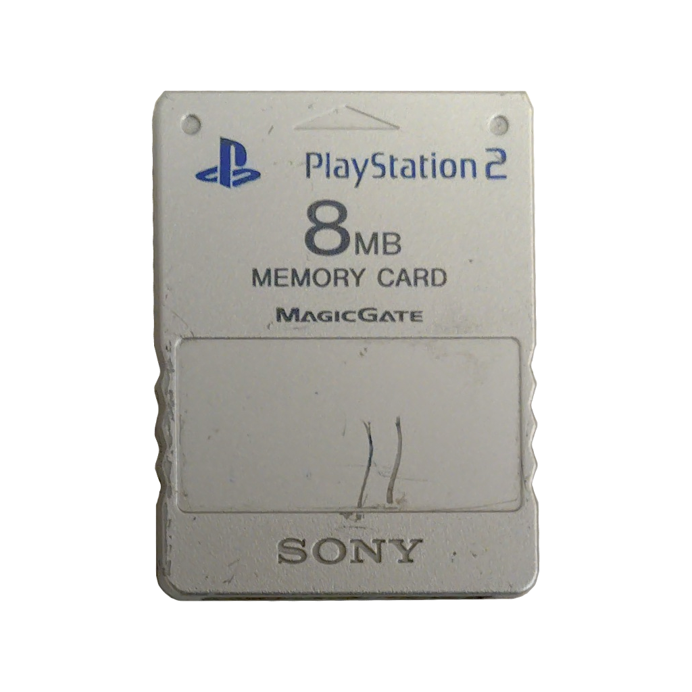
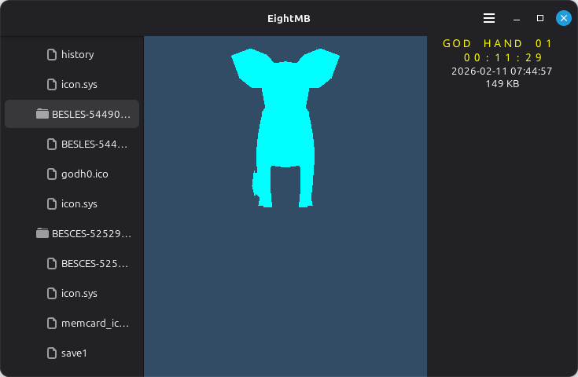

# EightMB

A work-in-progress tool for examining PlayStation 2 memory card images.

It can parse Sony's custom file system, kind-of show the 3D save icons, and dump the card contents.

Who knew that a GTK app isn't the best way to learn OpenGL 

GPL-3.0-or-later

## Acknowledgements

- Ross Ridge documented the file system: [PlayStation 2 Memory Card File System](./docs/PlayStation%202%20Memory%20Card%20File%20System.html)
- Martin Akesson documented the icon format:  http://www.csclub.uwaterloo.ca:11068/mymc/ps2icon-0.5.pdf
- caol64 expanded on the above: https://babyno.top/en/tags/ps2/
